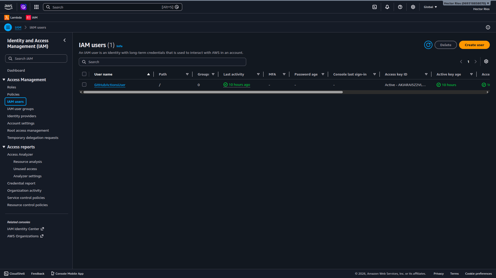
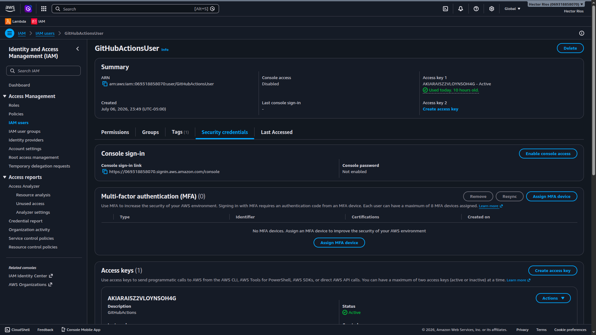
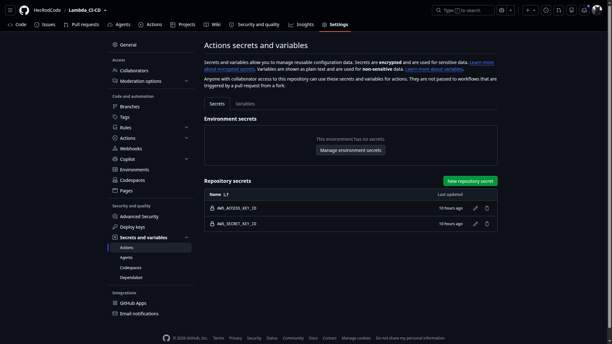

# Lambda CI/CD

Proyecto donde configure un flujo de CI/CD con GitHub Actions que invoque una función AWS Lambda cuando haya cambios en la rama Main

# Cosas necesarias para configurar bien el flujo

- Crear un usuario en IAM (AWS)
  
- Generar una Access Key y una Secret Key
  
- Configurar dos secretos en el repositorio en el que se hará el WorkFLow
  

# Verificación

Ve al workflow y verifica que las variables se llamen igual

```yml
with:
  aws-access-key-id: ${{ secrets.AWS_ACCESS_KEY_ID }}
  aws-secret-access-key: ${{ secrets.AWS_SECRET_KEY_ID }}
  aws-region: us-east-1
```

Verifica que se llamen igual y que la región sea la misma donde esta tu función Lambda